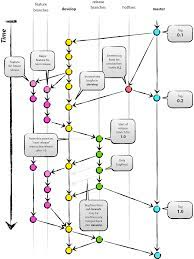

### Git-flow란?
- Git-flow는 효율적인 브랜치 관리 전략 중 하나이다.

### Git-flow의 구성
- master
  - 제품으로 출시될 수 있는 브랜치
- develop
  - 다음 출시 버전을 개발하는 브랜치
- feature
  - 기능을 개발하는 브랜치
- release
  - 이번 출시 버전을 준비하는 브랜치
- hotfix
  - 출시 버전에서 발생한 버그를 수정 하는 브랜치
  
### Git-flow의 흐름

- 기능 개발
  - develop 브랜치에서 feature 브랜치를 생성
  - feature 브랜치에서 기능 개발
  - 기능 개발이 완료되면 develop 브랜치에 merge
  - feature 브랜치 삭제
- 배포
  - develop 브랜치에서 release 브랜치를 생성
  - release 브랜치에서 배포 준비
  - 배포가 완료되면 master, develop 브랜치에 merge
  - release 브랜치 삭제
- 버그 수정
  - master 브랜치에서 hotfix 브랜치를 생성
  - hotfix 브랜치에서 버그 수정
  - 버그 수정이 완료되면 master, develop 브랜치에 merge
  - hotfix 브랜치 삭제

